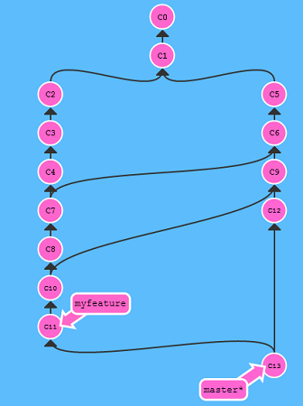

title: "Git Fundamentals - Rebasing"
author:
  name: Will Anderson
  twitter: itsananderson
  url: http://willi.am
output: index.html

--

# Git Fundamentals
## Rebasing - keep your commit history clean

--

### Introduction

Rebasing is replaying history

Follow along:

http://willi.am/git-fundamentals-rebasing/

https://github.com/itsananderson/rebase-examples

--

### Why?

Consider a common example  
You are working on a feature branch...

--

Now somebody does more work on the master branch

--

You could merge changes from master with  
`git merge master`

--

But then things get crazy if you do this several times when developing your feature

--

### There is a better way 

--

`git rebase master`

--

### Merge Conflicts

Sometimes a merge fails

--

Check your status: `git status`

--

Resolve conflicts and `git rebase --continue`

--

### Modifying History

What if we do not want C2, C3 *and* C4?

--

`git rebase -i master`

